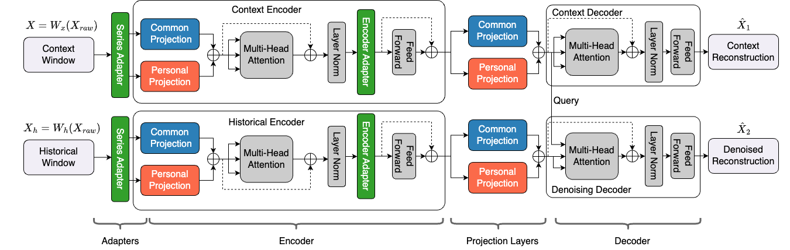

# KAD-Disformer

Welcome to the official GitHub repository for our paper titled **Pre-trained KPI Anomaly Detection Model Through Disentangled Transformer**. In this work, we introduce a novel KPI Anomaly Detection approach leveraging a disentangled Transformer architecture, designed to efficiently and effectively tackle the challenges of anomaly detection in time series data across diverse online service systems.

## Introduction

Online service systems, such as social networks, online shopping platforms, and mobile payment services, are integral to our daily lives. Ensuring the high quality and uninterrupted service of these systems necessitates advanced anomaly detection techniques. Traditional methods, while computationally efficient, often fall short in performance and flexibility. Our work proposes a new model, **KAD-Disformer**, which stands out by offering a universal, pre-trained model capable of unsupervised few-shot fine-tuning to adapt rapidly to new and unseen KPIs without the need for extensive data or time-consuming initialization.

## Key Contributions

- **Pre-trained Time Series-Based KPI Anomaly Detection Model:** Our model is a pioneering pre-trained model in the realm of time series anomaly detection, significantly enhancing the balance between effectiveness and efficiency.
- **Disentangled Projection Matrices:** We introduce a novel approach by disentangling the projection matrices in the Transformer architecture into common and personalized projections, enabling a fine balance between maintaining model capacity and achieving quick adaptation to new KPIs.
- **uTune Mechanism:** Our unique unsupervised few-shot fine-tuning mechanism allows for rapid adaptation to new KPIs with minimal risk of overfitting.



## Project Structure

- `src/train.py`: Script for pre-training the KAD-Disformer model.
- `src/finetune.py`: Script for fine-tuning the pre-trained model on a new dataset.
- `src/test.py`: Script for evaluating the performance of a trained model.
- `src/models/`: Contains the implementation of the KAD-Disformer model and its components.
- `src/utils/`: Contains utility functions for data loading, evaluation, and configuration.
- `data/`: Directory for storing datasets.
- `checkpoints/`: Directory for storing pre-trained model checkpoints.

## Getting Started

1. Clone the repository:

   ```bash
   git clone https://github.com/NetManAIOps/KAD-Disformer.git
   cd KAD-Disformer
   ```

2. Python 3.12+ installed and available on PATH

3. Install uv (the project using uv for dependency and environment management)

   ```bash
   pip install uv
   ```

4. Create and sync the environment:

   ```bash
   uv sync
   ```

   This creates a virtual environment and installs all dependencies from ⁠pyproject.toml and ⁠uv.lock.

## Usage

The project is divided into three main stages: pre-training, fine-tuning, and testing.

### 1. Pre-training

To pre-train the model, run the `train.py` script. This will train the model on the dataset specified by `--data_path` and save the final model to the `--checkpoint_dir`.

```bash
uv run src/train.py --data_path data/train.csv --checkpoint_dir checkpoints
```

You can customize the training process by modifying the arguments in `train.py`.

### 2. Fine-tuning

After pre-training, you can fine-tune the model on a smaller, specific dataset. The `finetune.py` script loads a pre-trained model, performs fine-tuning, and evaluates the performance before and after.

```bash
uv run python src/finetune.py --model_path checkpoints/model_final.pth --finetune_data_path data/finetune_train.csv --test_data_path data/finetune_test.csv
```

This will also generate `finetune_before_plot.html` and `finetune_after_plot.html` to visualize the model's performance.

### 3. Testing

To evaluate a trained model, use the `test.py` script. This will load the model and test it on the specified dataset, generating an F1 score and a visualization plot.

```bash
uv run src/test.py --model_path checkpoints/model_final.pth --data_path data/test.csv
```

The output plot will be saved as `test_plot.html`.


## Docker Image
To build and run the Docker container:

1. Build the Docker image:

   ```
   docker build -t kad_disformer .
   ```

2. Run the Docker container:

   ```
   docker run -it --rm kad_disformer
   ```
   Note: Make sure to mount the necessary data volumes or copy the required dataset files into the container before running it.


## Disclaimer
The resources, including code, data, and model weights, associated with this project are restricted for academic research purposes only and cannot be used for commercial purposes. This project does not accept any legal liability for the content of the model output, nor does it assume responsibility for any losses incurred due to the use of associated resources and output results.

## Support

If you encounter any issues or have questions, please raise an issue or submit a pull request.

## Citation

If you find our research useful, please consider citing our paper (citation details to be added upon publication).

```
@inproceedings{KAD_Disformer,
  author       = {Zhaoyang Yu and
                  Changhua Pei and
                  Xin Wang and
                  Minghua Ma and
                  Chetan Bansal and
                  Saravan Rajmohan and
                  Qingwei Lin and
                  Dongmei Zhang and
                  Xidao Wen and
                  Jianhui Li and
                  Gaogang Xie and
                  Dan Pei},
  editor       = {Ricardo Baeza{-}Yates and
                  Francesco Bonchi},
  title        = {Pre-trained {KPI} Anomaly Detection Model Through Disentangled Transformer},
  booktitle    = {Proceedings of the 30th {ACM} {SIGKDD} Conference on Knowledge Discovery
                  and Data Mining, {KDD} 2024, Barcelona, Spain, August 25-29, 2024},
  pages        = {6190--6201},
  publisher    = {{ACM}},
  year         = {2024},
  url          = {https://doi.org/10.1145/3637528.3671522},
  doi          = {10.1145/3637528.3671522},
  timestamp    = {Sun, 19 Jan 2025 13:22:19 +0100},
  biburl       = {https://dblp.org/rec/conf/kdd/YuPWMBRL0WLXP24.bib},
  bibsource    = {dblp computer science bibliography, https://dblp.org}
}
```

